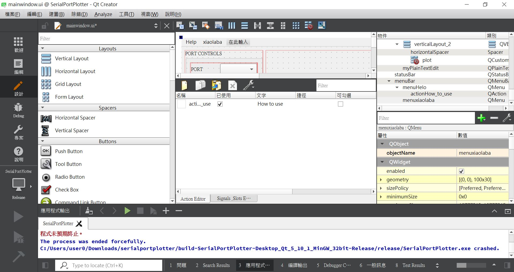
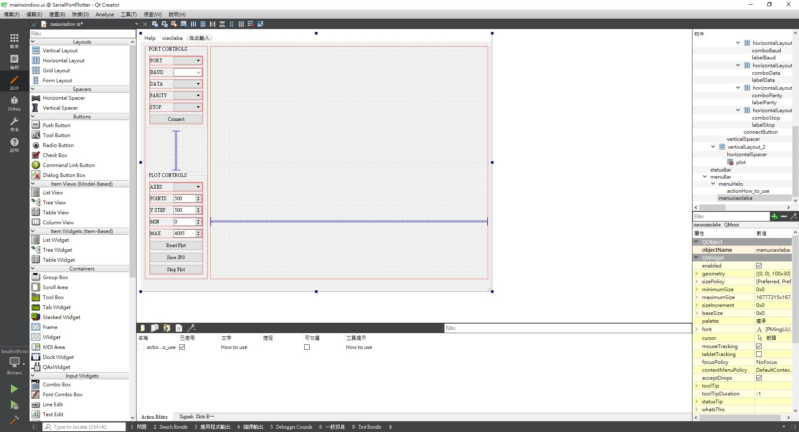
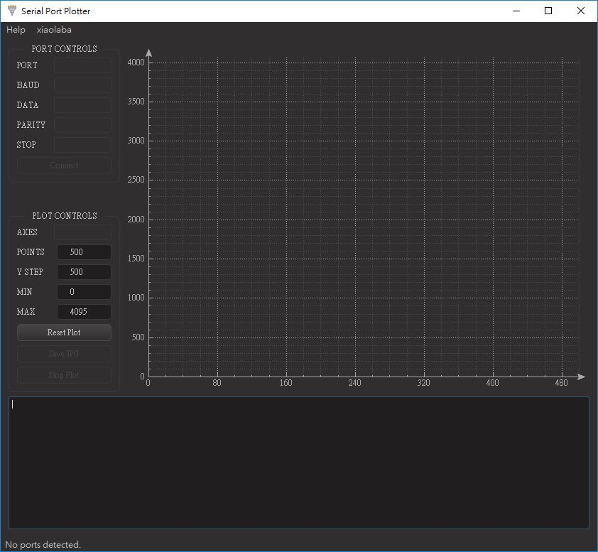
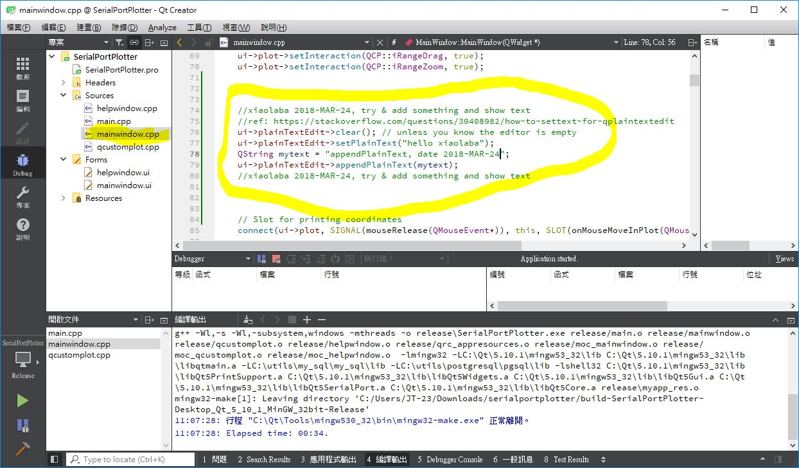
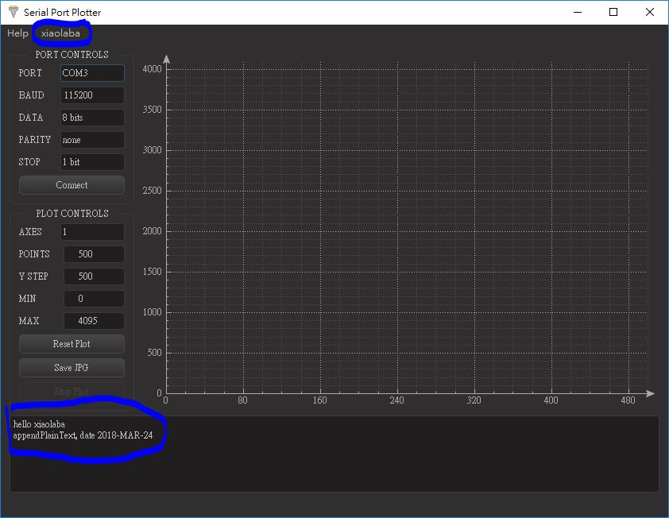
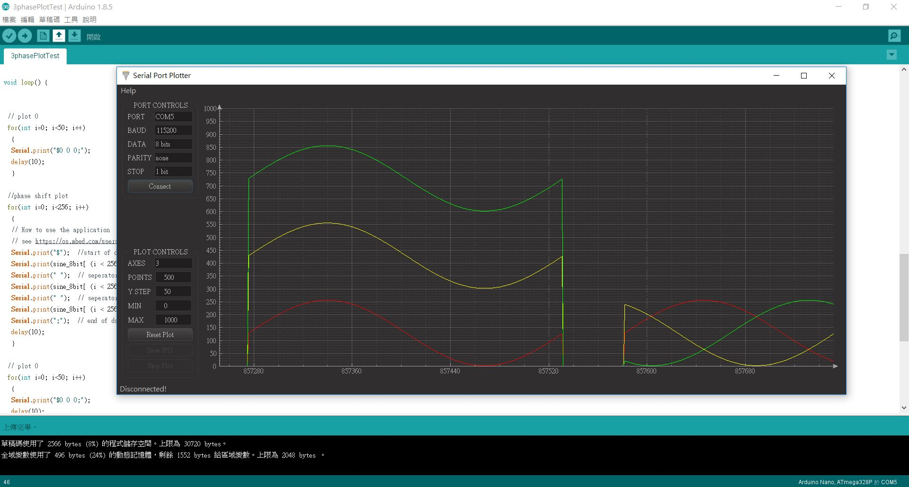

# Serial-Port-Plotter-clone
try and uses Qt5 for the build test   

The source files and project clone from <a href="https://os.mbed.com/users/borislav/notebook/serial-port-plotter/" target="blank">https://os.mbed.com/users/borislav/notebook/serial-port-plotter/  </a>  
as you want to build your own, go and get a copy;  
look at the page bottom carefully, https://os.mbed.com/media/uploads/borislav/serialportplotter.zip  
or local copy here 

tools:  
goto Qt website, donwload open source verison for compiling
i.e. https://www.qt.io/download-qt-installer?hsCtaTracking=9f6a2170-a938-42df-a8e2-a9f0b1d6cdce%7C6cb0de4f-9bb5-4778-ab02-bfb62735f3e5  

the online installer named as somehting like this when download is completed, qt-unified-windows-x86-3.0.2-online.exe  

run installer, select & install [ Qt Creator 4.5.2 ], install [ mingw530_32 ] as well, for Win10 OS, perhaps 2 to 3 hours for the installation.    

compiling, error & note :  
warning message should be with escape charecter or something, edit the file myapp.rc

change from:  (one slashes only)  
IDI_ICON1               ICON    DISCARDABLE     "Icons\exe_icon.ico"  

change to:  (used to be 2 slashes)  
IDI_ICON1               ICON    DISCARDABLE     "Icons\\\\exe_icon.ico"  

try and edit mainindow.ui as well, add something to the ui and see if it works.  
The result, yes, compile done and run, file size is about 622KB, my result,

C:\your path\serialportplotter\build-SerialPortPlotter-Desktop_Qt_5_10_1_MinGW_32bit-Release\SerialPortPlotter.exe  

build & release, goto C:\Qt\5.10.1\mingw53_32\bin, copy those following dll to project folder with SerialPortPlotter.exe together, this batch file will be easy the job other than manually everytime.   
libgcc_s_dw2-1.dll  
libstdc++-6.dll  
libwinpthread-1.dll  
Qt5Core.dll  
Qt5Gui.dll  
Qt5PrintSupport.dll  
Qt5SerialPort.dll  
Qt5Widgets.dll  

here is the result, we saw xiaolaba as dummy item in menu area, a sign for our test run, ok, that is all.

  
  
  
issue for Qt and computer screen size  
14" screen is too much over crowded, no easy and always mis-adjusted.  

  
  
23" screen is overall much better.  
  
  
  
  
  
  
Try to add something useful, perhaps a text output area for serial data or hex dump.  
  
  
how to do that:  
edit the ui, mainwindow.ui, include a new object, plainTextEdit  
  
  

edit ui-code, mainwindow.cpp, add code for plainTextEdit manipulation, mostly, like VBA programming
  
  
  
the ui code here,  
    //xiaolaba 2018-MAR-24, try & add something and show text  
    //ref: https://stackoverflow.com/questions/30408982/how-to-settext-for-qplaintextedit  
    ui->plainTextEdit->clear(); // unless you know the editor is empty  
    ui->plainTextEdit->setPlainText("hello xiaolaba");  
    QString mytext = "appendPlainText, date 2018-MAR-24";  
    ui->plainTextEdit->appendPlainText(mytext);  
    //xiaolaba 2018-MAR-24, try & add something and show text  
  
  
yeah, job done
  
  
  
    
PC host software should be ready, try & dump some data from serial port, uses Uno and dummy data set, 3 lines plot,  
it works and done,
Arduino source code,   
hex file1,   
hex file2,   

