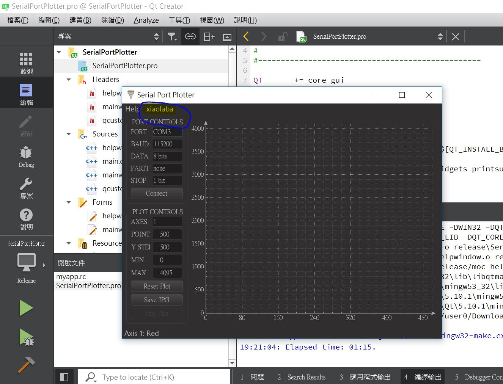

# Serial-Port-Plotter-clone
try and uses Qt5 for the build test   

The source files and project clone from https://os.mbed.com/users/borislav/notebook/serial-port-plotter/  

tools:  
goto Qt website, donwload open source verison for compiling
i.e. https://www.qt.io/download-qt-installer?hsCtaTracking=9f6a2170-a938-42df-a8e2-a9f0b1d6cdce%7C6cb0de4f-9bb5-4778-ab02-bfb62735f3e5  

the online installer named as somehting like this when download is completed, qt-unified-windows-x86-3.0.2-online.exe  

run installer, select & install [ Qt Creator 4.5.2 ], install [ mingw530_32 ] as well, for Win10 OS, perhaps 2 to 3 hours for the installation.    

compiling, error & note :
warning message should be with escape charecter or something, edit the file myapp.rc

change from:  
IDI_ICON1               ICON    DISCARDABLE     "Icons\exe_icon.ico"  

change to:  
IDI_ICON1               ICON    DISCARDABLE     "Icons\\exe_icon.ico"  

try and edit mainindow.ui as well, add something to the ui and see if it works.  
The result, yes, compile done and run, file size is about 622KB, my result,

C:\your path\serialportplotter\build-SerialPortPlotter-Desktop_Qt_5_10_1_MinGW_32bit-Release\SerialPortPlotter.exe  

build & release, goto C:\Qt\5.10.1\mingw53_32\bin, copy those following dll to project folder with SerialPortPlotter.exe together,    
libgcc_s_dw2-1.dll  
libstdc++-6.dll  
libwinpthread-1.dll  
Qt5Core.dll  
Qt5Gui.dll  
Qt5PrintSupport.dll  
Qt5SerialPort.dll  
Qt5Widgets.dll  

here is the result, we saw xiaolaba as dummy item in menu area, a sign for our test run, ok, that is all.

